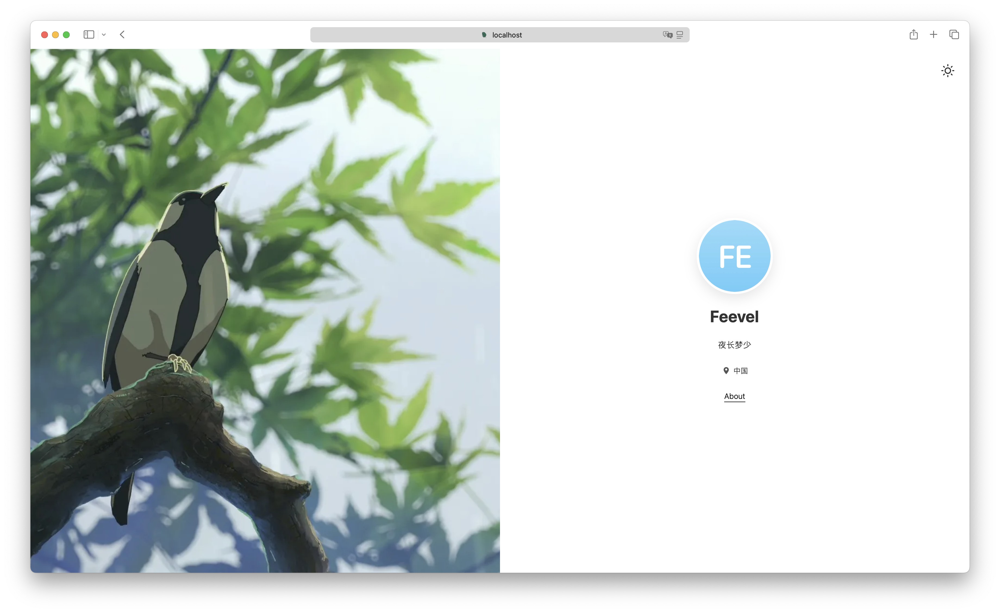
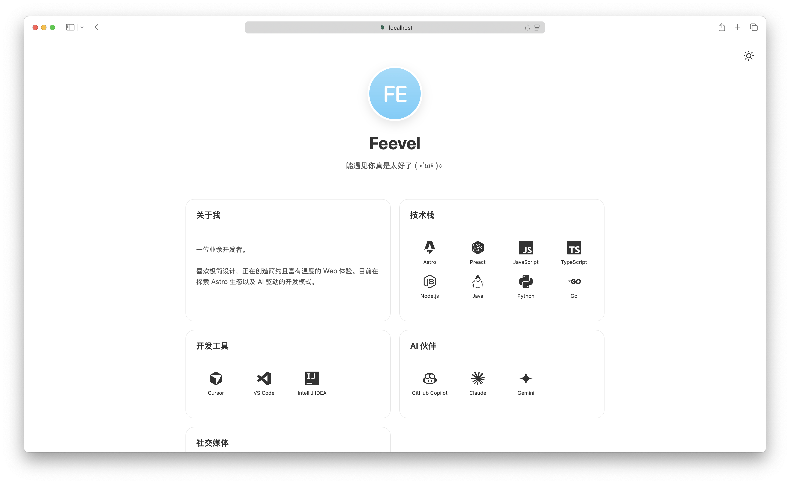
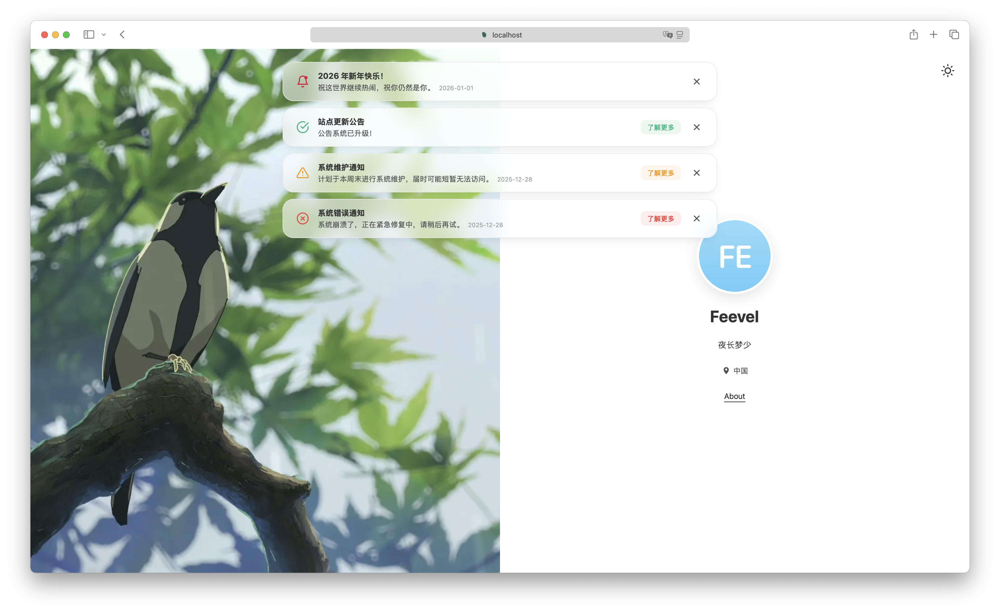

# Airy Personal Page

一个极简、优美且高性能的个人引导页，专为现代 Web 打造。

<p align="center"></p>
<p align="center"></p>

## 🛠️ 技术栈

- **Astro 5.0+**: 现代高性能 Web 框架，默认零 JS 运行。
- **Preact**: 轻量级 React 替代方案，用于处理复杂的客户端交互岛屿。
- **TypeScript**: 全站使用 TypeScript 提供更可靠的开发体验和类型安全。

## ✨ 项目特性

- **现代架构**: 基于 Astro 5.0+ 构建，零 JavaScript 运行时（Zero-JS），首屏加载极快。
- **混合组件化开发**: 核心页面采用 Astro 极致性能，局部复杂交互通过 **Preact (TSX) 岛屿** 实现，兼顾开发效率与运行性能。
- **配置化驱动**: 导航链接、站点配置、内容数据均由 `config/site.yaml` 承载，修改即生效。
- **暗色模式支持**: 内置深色主题，支持跟随系统或一键切换，并本地持久化记录偏好。
- **响应式设计**: 针对移动端、平板、PC 进行响应式优化，确保跨端体验一致。
- **Bento 布局**: 内容页面采用现代 Bento Grid 风格设计，支持可配置化的内容模块，兼具秩序感与美感。

## 📂 项目结构

项目遵循 Astro 的标准目录规范，核心逻辑位于 `src/` 目录下：

```text
├── src/
│   ├── assets/             # 静态资源 (图片、字体)
│   ├── components/         # 组件
│   │   ├── common/           # 通用 Preact 岛屿组件
│   │   ├── layout/           # 布局组件
│   │   └── theme/            # 主题切换组件
│   ├── constants/          # 常量定义 (运行时枚举、映射)
│   ├── layouts/            # 布局组件 (页面骨架)
│   ├── pages/              # 页面路由 (文件名即路径)
│   ├── styles/             # 全局样式 (CSS)
│   ├── types/              # 类型定义 (全局 TypeScript 定义)
│   ├── utils/              # 工具函数
│   └── content.config.ts   # 内容配置 (Astro)
├── public/                 # 静态资源 (图片、favicon)
├── config/                 # 配置文件
│   └── site.yaml           # 站点信息配置
├── astro.config.mjs        # Astro 配置文件
├── tsconfig.json           # TypeScript 配置 (支持 JSX 路径映射)
├── package-lock.json       # 项目依赖管理锁定文件
└── package.json            # 项目依赖管理
```

## 🏗️ 架构说明

### 1. 组件系统 (Components)
本项目采用了 Astro 的标准组件模式：
- **BaseLayout**: 这是所有页面的“外壳”。它统一管理了 `<body>` 结构，包含主题切换组件以及 `BaseFooter`组件。
- **SplitLayout**: 分栏布局组件，可配置左右分栏比例，支持 Banner 和自定义内容插槽注入。
- **BaseHead**: 独立的头部组件。封装了 SEO Meta、Favicon、viewport 设置等通用逻辑，包含极小的 Inline JS 以防止页面闪烁，并支持插槽注入。
- **BaseFooter**: 独立的页脚组件，并针对分栏布局进行了适配。
- **ThemeToggle**: 独立的主题切换逻辑。
- **Preact Islands**: 对于涉及复杂状态管理的交互，使用 Preact 驱动的岛屿组件（`.tsx`），通过 `client:*` 指令实现局部水合。
  - **Announcement**: 全局公告组件（Preact 岛屿）。基于 `site.yaml` 配置，支持多条公告轮播、语义化颜色（Info/Success/Warning/Error）以及基于 `localStorage` 的用户消除状态持久化。

### 2. 样式管理 (Styling)
| 文件 | 职责 |
|------|------|
| `src/styles/global.css` | 全局样式入口，导入基础样式 |
| `src/styles/base/*.css` | CSS Reset、全局字体、主题颜色等基础组件样式 |
| `src/components/*.css` | 组件样式 |

## 🚀 构建指南

### 前置要求
- Node.js (v18.20.8 或更高版本)
- npm

### 1. 安装依赖
```bash
npm install
```

### 2. 启动本地开发服务器
```bash
npm run dev
```
访问 `http://localhost:4321` 即可预览。

### 3. 构建生产版本
```bash
npm run build
```
构建产物将生成在 `dist/` 目录下，可直接部署到任何静态托管服务（Vercel, Netlify, GitHub Pages, Nginx 等）。

## 🎨 定制指南

想要把这个主页改成你自己的？非常简单：
1. **修改站点配置**: 编辑 `config/site.yaml`，更新站点标题、描述、公告等信息。
2. **调整样式**: 如果需要个性化样式，可以修改 `src/styles/` 与 `src/components/` 目录下的 CSS 文件。
3. **添加/修改页面**: 在 `src/pages/` 目录下添加或修改页面文件。
4. **SEO 与 Sitemap**: 根据需要调整 `src/components/BaseHead.astro` 中的 SEO 设置以及 `astro.config.mjs` 中的 `site` 配置。

Astro 5.0+ 高级特性 `View transitions` 适配（默认未启用）：
1. 参考 [Astro 文档](https://docs.astro.build/en/guides/client-side-routing/) 进行配置。
2. 取消注释 `ClientRouter` 相关适配代码。
3. 在全局组件或页面共用组件中，请根据需要添加 `transition:persist`、`transition:name` 等属性。

## 📦 部署建议

由于是纯静态网站，推荐使用以下零成本方案：
- **GitHub Pages**: 将代码推送到 GitHub，开启 Pages 服务即可（需配合 GitHub Actions 自动构建）。
- **Vercel / Netlify**: 关联 GitHub 仓库，自动识别 Astro 框架并一键发布。
- **自建 Nginx**: 将 `dist/` 目录上传至服务器，配置 Nginx 指向该目录的 `index.html`。

## 📜 许可证

[MIT License](LICENSE)